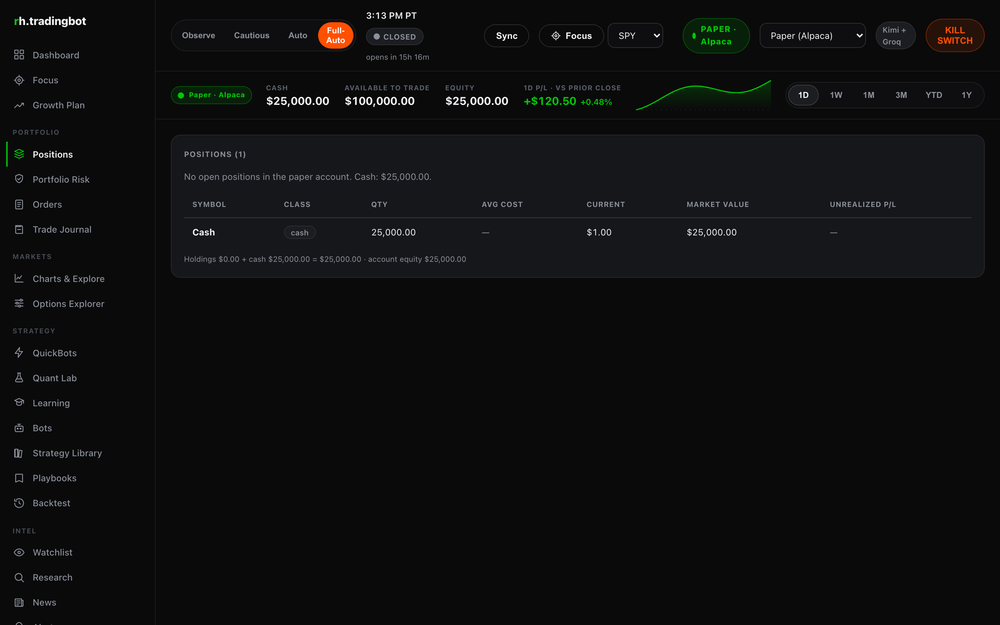
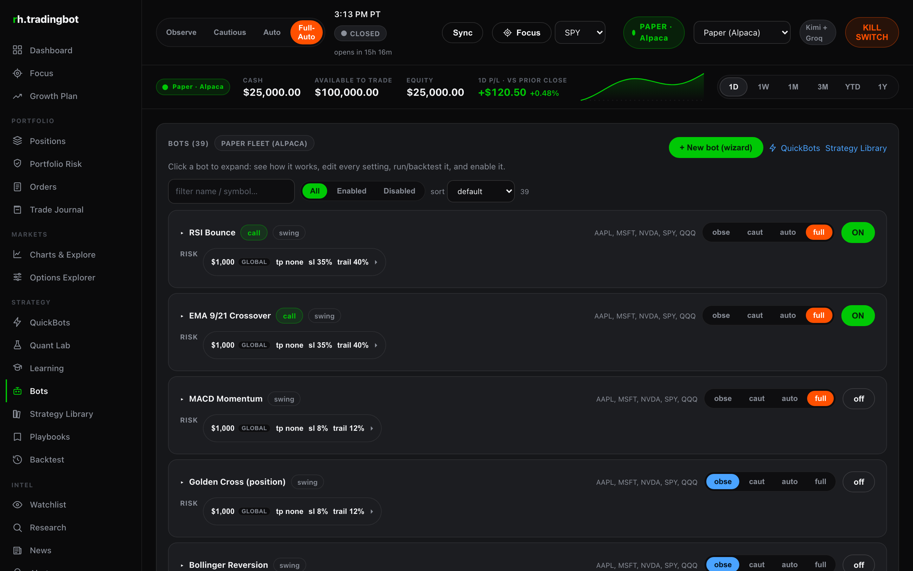
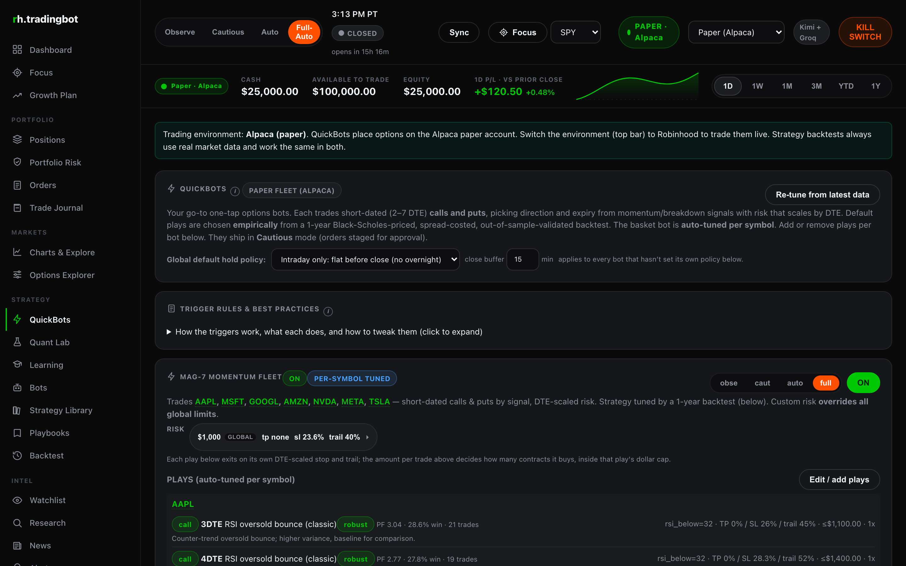
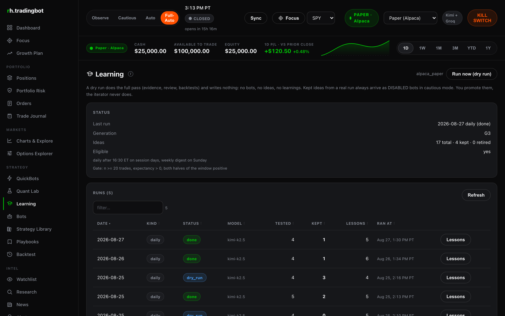
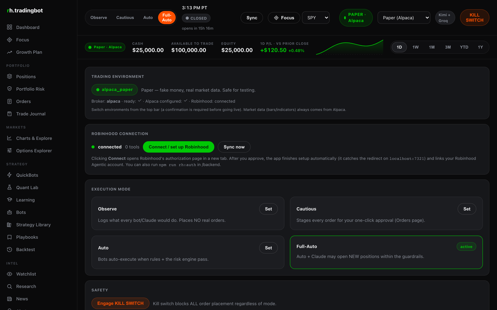

# rh-trader

A local trading dashboard and bot platform that runs on your own machine. A Node 22 and
TypeScript backend (Fastify) listens on `127.0.0.1:8011`, serves the built React interface
itself, and keeps every account snapshot, order, signal and risk decision in a local MySQL
database. It talks to two brokers: Alpaca for paper trading and market data, and Robinhood's
agentic MCP for orders in an isolated agentic account. Language models handle the parts they
are good at (triaging news, drafting and backtesting strategy ideas, answering questions about
your own data in SQL), and a deterministic risk engine decides what is allowed to reach a
broker. Nothing trades until you turn it on, and the crypto block is not a setting.

---

## Read this before you run it

> **This software can place real orders with real money.** The Robinhood path trades in a live
> brokerage account. Trading equities and options can lose money, including more than you
> expect and faster than you expect. Short-dated options in particular can go to zero.
>
> **No warranty.** Provided as is, under the MIT license. The author is not liable for any
> loss, missed exit, bad fill, stale quote, broker outage, model hallucination, or bug.
>
> **Not financial advice.** No part of this repository, its strategies, its backtests or its
> model output is a recommendation. Backtested results are simulations and do not predict
> future returns.
>
> **Start in paper and observe.** The defaults ship that way: trading environment
> `alpaca_paper`, global mode `observe`, every bot disabled. Watch it for a while, read the
> journal, and only then decide whether to give it money. You are responsible for every order
> placed under your credentials.

---

## Set up with Claude Code in five steps (beginners start here)

You do not need to know Node, MySQL or React. A coding agent does the install and stops to ask
you for the few things only you can provide: your Alpaca paper keys, whether to connect
Robinhood, and which language model you want to use. Plan on 15 to 20 minutes, most of it the
agent working while you watch.

1. **Install Claude Code.** Follow the one-line install at
   [claude.com/claude-code](https://claude.com/claude-code) and sign in. Any other coding agent
   that can run shell commands works too (Codex, Cursor, Gemini CLI): the prompt is the same.
2. **Get free Alpaca paper keys.** Sign up at [alpaca.markets](https://alpaca.markets/), switch
   the dashboard to Paper Trading, and generate an API key and secret. Keep the tab open.
3. **Make an empty folder and open the agent in it.** For example:
   `mkdir rh-trader && cd rh-trader && claude`
4. **Paste the whole block below as one message.** The agent clones the app, installs what is
   missing, and pauses four times to ask you questions. Answer them; it stores your answers in a
   local `.env` file that never enters git.
5. **Open the dashboard.** When the agent says it is done, go to
   [http://127.0.0.1:8011](http://127.0.0.1:8011). You are in paper mode, every bot is off, and
   nothing trades until you turn something on. Read the safety section above before you do.

Copy everything inside the box:

```text
You are setting up rh-trader, a local trading dashboard and bot platform, in the CURRENT
folder. Work through the steps in order. Show me each command before you run it. Stop and ask
whenever a step below says to ask.

HARD RULES, these override anything else in this prompt:
- Never run `git add`, `git commit` or `git push` for .env, backend/data/oauth-tokens.json, any
  file matching *token*, *secret*, *credential*, or any .sql dump. Secrets go in .env only.
- Never place a trade, never call any order endpoint, and never switch the trading environment
  to robinhood_live during setup. Setup ends in paper mode with every bot disabled.
- Never print an API key or an OAuth token back to me in full. Echo the last 4 characters at
  most when you need to confirm something landed.
- If a step fails, stop and tell me what failed and what you tried. Do not improvise around a
  failure by weakening a safety setting.

STEP 1: PREREQUISITES
Check `node -v` (need 22 or newer), `npm -v`, `mysql --version` (need 5.7 or 8), and
`git --version`. For anything missing, tell me what is missing and how you propose to install
it on this OS, then ask before installing. On macOS with Homebrew that is usually
`brew install node@22` and `brew install mysql` plus `brew services start mysql`. If MySQL is
already running as part of MAMP, XAMPP, Docker or anything else, use that instead of installing
a second one, and note the host, port, user and password so we can put them in .env.

STEP 2: CLONE AND INSTALL
Run `git clone https://github.com/erichers/rh-trader.git .` in this folder (or into ./rh-trader
and cd into it if the folder is not empty). Then `npm install` in ./backend and `npm install`
in ./frontend.

STEP 3: DATABASE
db/schema.sql creates the database rh_tradingbot and every table, and it is idempotent. Load it
with the MySQL you identified in step 1, for example:
  mysql -h 127.0.0.1 -P 3306 -u root -p < db/schema.sql
Confirm it worked by counting tables:
  mysql -h 127.0.0.1 -P 3306 -u root -p -e "SELECT COUNT(*) FROM information_schema.tables WHERE table_schema='rh_tradingbot'"
Expect 30 tables. The backend also runs a migrate() on boot that adds any missing
columns and indexes, so a partially old schema is fine.

STEP 4: .env
Run `cp .env.example .env`. Set DB_HOST, DB_PORT, DB_USER, DB_PASSWORD and DB_NAME to the MySQL
you just used. Leave the safety block exactly as it ships: DEFAULT_MODE=observe,
KILL_SWITCH=false, ALLOWED_ASSET_CLASSES=equity,etf,option, and the four numeric caps.
.env.example does not yet carry the broker environment keys, so append these lines:
  TRADING_ENV=alpaca_paper
  ALPACA_API_KEY=
  ALPACA_SECRET_KEY=
Confirm .env is covered by .gitignore before writing anything sensitive into it
(`git check-ignore -v .env` must print a match).

STEP 5: ASK ME ABOUT ALPACA (one topic, wait for my answer)
Say this to me, then wait:
  "rh-trader uses Alpaca for paper trading and for all market data: quotes, bars, option
   chains, and the market clock. It needs a PAPER key pair.
   1. Sign up free at https://alpaca.markets/
   2. Open https://app.alpaca.markets/ and make sure the dashboard is on Paper Trading, not Live
   3. Generate an API key pair. The secret is shown once, copy both values now.
   Paste the key id and the secret here, or say 'skip' to set them up later."
Write my answer into .env as ALPACA_API_KEY and ALPACA_SECRET_KEY. Do not echo the secret back.
If I skip, continue: the app will start, but positions, quotes and bots will have no data.

STEP 6: ASK ME ABOUT ROBINHOOD (one topic, wait for my answer)
Say this to me, then wait:
  "Optional, and this is the real-money path. rh-trader can connect to Robinhood's agentic MCP
   endpoint. Authorizing creates a Robinhood Agentic account: a separate, isolated account that
   an agent can trade, that starts unfunded, and that you fund deliberately from the Robinhood
   app. Every other account in your Robinhood profile stays read-only to the agent, every agent
   trade sends you a push notification, and you can disconnect the agent from the Robinhood app
   at any time. It needs a primary individual investing account in good standing and a desktop
   browser.
   You can skip this now and do it any time later from Settings, Connect.
   Connect Robinhood now? yes / no"
If yes: run `npm run rh:auth` inside ./backend. It opens your browser and listens on
http://localhost:7321/callback for the redirect, then writes tokens to
backend/data/oauth-tokens.json and the oauth_tokens table (both gitignored). Tell me to complete
the authorization in the browser window, and wait for the CLI to report success.
Then tell me, and do NOT do it yourself: "Connected. The trading environment is still
alpaca_paper. Nothing will trade on Robinhood until you fund that account in the Robinhood app
and switch the environment yourself, with an explicit confirmation."
If no: continue, and mention it can be done later from Settings, Connect.

STEP 7: ASK ME ABOUT LLM PROVIDERS (one topic, wait for my answer)
Say this to me, then wait:
  "Which language model providers do you have? Any subset works, including none. Without any
   key the bots, rules, backtests, monitors and risk engine still run; research, news triage,
   Ask AI, the trade agent and the learning iterator go quiet.
   a) Groq, free tier, https://console.groq.com/keys . Fast, leads the chat and news-triage
      tasks. Free limits are 30 requests/min, 8K tokens/min and 1K requests/day per model.
   b) NVIDIA NIM, free developer tier, https://build.nvidia.com/ . Roughly 40 requests/min,
      extra fallback capacity, and the only source of embeddings for the search layer.
   c) Kimi / Moonshot, paid, https://platform.moonshot.ai/ . Strong second rung for research
      and the daily review.
   d) Anthropic, paid, https://console.anthropic.com/ . Optional. The key may be invalid; the
      router will skip it. Tell me which model id your account can use if you have one.
   e) Meta Muse Spark, https://ai.developer.meta.com/ . Leads watch, performance, and agent
      (short ops). Key goes in META_MUSE_API_KEY (aliases MUSE_API_KEY and Meta's MODEL_API_KEY).
      Default model muse-spark-1.3 (PAYG Standard, chat completions HTTP 200).
   f) A local OpenAI-compatible server, free. Ollama (http://localhost:11434/v1) or LM Studio
      (http://localhost:1234/v1). I will need the base URL and the exact model id the server
      returns from GET /v1/models.
   Paste the keys you want to use, and say which of these you are skipping."
Write the answers into .env only: GROQ_API_KEY, NVIDIA_API_KEY, KIMI_API_KEY,
ANTHROPIC_API_KEY plus ANTHROPIC_MODEL, META_MUSE_API_KEY (or MUSE_API_KEY / MODEL_API_KEY),
and for a local server LOCAL_BASE_URL, LOCAL_MODEL and
LOCAL_API_KEY (Ollama ignores the key value but the variable must be non-empty).
If I chose a local server, verify it is reachable and that the model id exists:
  curl -s $LOCAL_BASE_URL/models
and tell me if the id I gave is not in the list. Also tell me plainly: a small local model is
fine for news triage and acceptable for chat, but weak at tool calls and strict JSON, so keep a
hosted provider configured behind it or the agent, review and ideas tasks may fail silently.

STEP 8: BUILD AND START
Run `npm run build` in ./frontend (this produces frontend/dist, which the backend serves
itself, no Apache or MAMP needed). Then start the backend from ./backend with `npm start` and
leave it running in the background, capturing its log where you can read it.

STEP 9: VERIFY
  curl -s http://127.0.0.1:8011/api/health
Expect ok:true, db:true, env:"alpaca_paper", live:false, mode:"observe", and a broker block
where alpacaConfigured is true if I gave you Alpaca keys.
  curl -s http://127.0.0.1:8011/api/ai/models
Expect a tasks object with a resolved chain for chat, triage, research, agent, review,
ideas, watch and performance, and a providers object (including muse when a Meta key is set).
A provider with live_ids 0 and an error string has a bad key or base URL: tell me which one
and what the error says. A provider I skipped should simply be absent from the chains.
Also hit:
  curl -s http://127.0.0.1:8011/api/muse/status
  curl -s http://127.0.0.1:8011/api/watch/status
Those payloads must never contain an API key. watch.universe should be SPY, META, TSLA, QQQ
unless I set WATCH_UNIVERSE. Then open http://127.0.0.1:8011/ in my browser.
If either check fails, show me the backend log and the exact failing response. Do not change a
safety setting to make a check pass.

STEP 10: HAND OVER
Finish by telling me, in your own words:
- The app is in PAPER mode. TRADING_ENV=alpaca_paper means orders go to the Alpaca paper
  account: fake money, real market data. The only real-money path is robinhood_live, which
  requires connecting Robinhood, funding that agentic account from the Robinhood app, and
  switching the environment with an explicit confirmation. Setup did not do any of that.
- Every bot was seeded DISABLED and in cautious mode, and the global mode is observe, which
  logs what would have happened and places nothing. Nothing trades until I enable it.
- The kill switch, on the Settings page and at POST /api/kill, blocks all new buying regardless
  of mode and still allows close-only sells, so stop-losses and take-profits keep working while
  it is engaged.
- Risk limits live in .env: MAX_POSITION_USD, MAX_PORTFOLIO_CONCENTRATION_PCT,
  MAX_DAILY_LOSS_PCT, MAX_ORDERS_PER_DAY. Cryptocurrency is blocked permanently and is not a
  setting.
- .env holds my secrets and is gitignored. Confirm that `git status --porcelain` shows no .env
  and no token file, and that nothing was committed during setup.
```

If the agent proposes to commit your `.env`, your OAuth tokens, or to place an order during
setup, stop it: the prompt forbids all three. The manual path is in
[`docs/SETUP.md`](docs/SETUP.md); the prompt on its own lives in
[`docs/SETUP-PROMPT.md`](docs/SETUP-PROMPT.md).


## Screenshots

| View | Image |
| --- | --- |
| Dashboard | `docs/screenshots/dashboard.png` |
| Positions | `docs/screenshots/positions.png` |
| Bots | `docs/screenshots/bots.png` |
| QuickBots | `docs/screenshots/quickbots.png` |
| Learning | `docs/screenshots/learning.png` |
| Settings | `docs/screenshots/settings.png` |








---

## What it does

**Two brokers, one interface.** `alpaca_paper` is the default: fake money, real market data,
real option chains, real bars for every indicator. `robinhood_live` connects to Robinhood's
agentic MCP endpoint over OAuth and places orders in the isolated Robinhood Agentic account,
which starts unfunded and which you fund deliberately from the Robinhood app. Switching to the
live environment requires an explicit confirmation in the API call, and the interface asks
again.

**Everything is scoped to the account.** Bots, fleets, orders, position monitors, journal
entries, equity snapshots and P/L windows all carry the environment they belong to. Connecting
a second account gives you a fresh fleet, disabled and in cautious mode, with no inherited
picks or tuning from the other account.

**Four execution modes**, global and per bot:

- `observe`: log what would have happened, place nothing.
- `cautious`: stage every order for one-click approval.
- `auto`: bots execute when their rules and the risk engine both pass.
- `full_auto`: as above, plus the model may open new positions inside the guardrails.

**A deterministic risk engine at a single chokepoint.** Every order intent goes through
`execute.ts` into `risk/engine.ts` before any broker call, in every mode. Long only, no short
selling, no naked option writing, sells cannot exceed held quantity, per-position dollar cap,
concentration cap, daily-loss cap, orders-per-day cap. Concentration and daily loss fail closed
when account equity is missing or stale. The kill switch blocks new buying regardless of mode
and still lets close-only sells through, because exits are protection, not exposure. The model
proposes; code disposes.

**No cryptocurrency, ever.** Blocked by asset class and by symbol heuristic, at the risk engine
and again at the broker boundary. It is not a config flag you can flip.

**Strategy library.** 18 prebuilt rule strategies: swing setups (RSI bounce, EMA 9/21 cross,
MACD momentum, golden cross, Bollinger reversion, Donchian breakout, trend follower), intraday
setups, long-call and long-put structures, and two AI-gated setups. Rules are data, evaluated
by one engine, so the live evaluation and the backtest evaluation cannot drift apart.

**QuickBots.** Short-dated option plays (1 to 7 DTE) on the Mag-7 plus SPY and QQQ, from a
24-strategy candidate catalog: trend-aligned momentum, breakouts, acceleration, pullback buys,
counter-trend snapbacks and put structures. Backtests reprice the option along the real
underlying path with Black-Scholes (realized vol, theta, gamma), charge a 4% round-trip cost,
and prefer plays that hold up out of sample in both halves of the window; a pick that only
worked in sample is used as a clearly labeled fallback, never silently. A leaderboard ranks
every strategy by symbol and DTE on expectancy, not win rate, and a single button adds a row
to a managed bot.

**Position monitors.** Take-profit, stop-loss and trailing stops evaluated on the option premium
or the share price every 45 seconds. A monitor closes only when an exit actually filled; a failed
exit stays open and retries rather than silently abandoning the stop. A hold policy flattens
before the close and before weekends and holidays by default, overridable per bot.

**A daily and weekly learning iterator.** After the US close on trading days, and again on
Sundays, the iterator builds an evidence pack from real trades, asks one model for lessons,
parameter suggestions and new strategy ideas expressed in the engine's own rule vocabulary,
validates them, and backtests each idea honestly (minimum 20 trades, positive expectancy,
positive in both halves). Ideas that survive become **disabled**, cautious bots with lineage
back to the run that proposed them. The iterator never enables a bot and never escalates a
mode. Losers retire after eight paper trades.

**A task-based model router.** Six tasks (`chat`, `triage`, `research`, `agent`, `review`,
`ideas`), each with an ordered chain across providers. Every provider's `/models` endpoint is
probed at boot and every six hours; an id that has gone dark is swapped for the next live id on
that provider's ladder, and the swap is written to the audit log. `LLM_POISON_PROVIDERS=groq`
forces a provider to throw on every call so you can prove the fallback path without editing
code.

**Other surfaces.** Journal with per-trade notes, portfolio risk view, alerts with rules and a
news monitor, research and news per ticker, watchlist, backtest workbench, playbooks, campaign
tracking, and Ask AI: a text-to-SQL chat over your own database, with a hybrid retrieval layer
(MySQL FULLTEXT ranks fused with embedding cosine ranks by reciprocal rank fusion) over trades,
research and learnings. Embeddings are optional and come from NVIDIA NIM when a key is present.

---

## Architecture

```
                      browser  (React 18 + Vite SPA, built to frontend/dist)
                                            |
                                            v
  +--------------------------------------------------------------------------+
  |   backend   Node 22 + TypeScript + Fastify        http://127.0.0.1:8011   |
  |                                                                          |
  |   routes/api.ts   REST + /ws status socket, and serves the built SPA      |
  |   bots/           strategy library + generic rule engine                  |
  |   quickbot.ts     short-DTE option plays, backtests, leaderboard          |
  |   ai/             task router (chat, triage, research, agent, review,     |
  |                   ideas), live /models probe, per-task fallback chains    |
  |   learning.ts     daily + weekly iterator, new ideas ship DISABLED        |
  |   rag.ts          hybrid retrieval, optional embeddings                   |
  |   risk/           deterministic engine, sizing, position monitors         |
  |   execute.ts      THE chokepoint: every order intent passes through here  |
  |   brokers/        Alpaca REST  |  rh/  Robinhood MCP client (OAuth)       |
  |   worker.ts       market-hours loop: sync, evaluate, monitor, learn       |
  +--------------------------------------------------------------------------+
        |                        |                            |
        v                        v                            v
   MySQL 5.7+ / 8          Alpaca                    Robinhood agentic MCP
   db/schema.sql           paper orders, bars,       OAuth in the browser,
   migrate() on boot       option chains, clock      isolated agentic account,
                                                     REAL money
                                    ^
                                    |
        LLM providers (any subset):  Muse Spark (Meta Model API)  |  Groq  |
        NVIDIA NIM  |  Kimi  |  Anthropic  |  local OpenAI-compatible server
```

No Apache and no MAMP are required. The Fastify server serves the SPA from `frontend/dist`,
so `http://127.0.0.1:8011/` is the whole app. (The author happens to run MAMP for MySQL and
puts Apache in front of it; both are optional, see `docs/SETUP.md`.) An optional Tauri wrapper
in `app-native/` opens the same URL in a native macOS window.

---

## Setup

The beginner path is the five steps near the top of this page: one prompt, one folder, a few
questions. The manual, step-by-step route (prerequisites, database, `.env`, Robinhood OAuth,
providers, build, run, verify) is in [`docs/SETUP.md`](docs/SETUP.md). Both end with the backend
on `127.0.0.1:8011` serving the built interface; no web server or proxy is required.

## Providers and models

The app runs with any subset of providers. With no key at all, the deterministic parts (bots,
rules, monitors, backtests, risk engine) still work; only the model-driven features go quiet.
Chains and model ids live in one file, `backend/src/ai/models.ts`, and `GET /api/ai/models`
shows the resolved chain per task plus the last probe result.

| Task | What uses it | Leads with | Falls back to | Why in that order |
| --- | --- | --- | --- | --- |
| `chat` | Ask AI text-to-SQL, assistant | Groq `openai/gpt-oss-120b` | Groq 27b and 20b, NVIDIA, Kimi, Muse, Anthropic | Short prompts, one user waiting, latency is the whole experience |
| `triage` | News classification, quick ticker reads | Groq `openai/gpt-oss-20b` | Groq 27b and 120b, NVIDIA, Kimi, Muse, Anthropic | Tiny prompts, hundreds of calls a day, the cheapest rung is enough |
| `research` | Long analytical passes on a symbol | NVIDIA Nemotron-3 Super | NVIDIA 49b, Groq 120b, Muse, Kimi, Anthropic | Heavy research stays on NVIDIA then Groq; Muse is the backup |
| `review` | The daily learning pass over every trade | NVIDIA Nemotron-3 Super | Groq 120b, Muse, Kimi, Anthropic | Same shape as research |
| `ideas` | New strategy generation | NVIDIA Nemotron-3 Super | Groq 120b, Muse, Kimi, Anthropic | Same shape as research |
| `agent` | Tool loops (read-only in Observe) | Muse Spark `muse-spark-1.3` | NVIDIA, Groq, Kimi, Anthropic | Short ops judgments; Muse first |
| `watch` | SPY / META / TSLA / QQQ news + indicator loop | Muse Spark `muse-spark-1.3` | Groq 20b, NVIDIA, Kimi, Anthropic | Fast desk watch. Writes alerts and notes. Never places an order. |
| `performance` | Paper equity / ops note on each watch cycle | Muse Spark `muse-spark-1.3` | Groq 20b, NVIDIA, Kimi, Anthropic | Same as watch |

Unconfigured providers are skipped. Muse's own ladder leads with PAYG Standard `muse-spark-1.3` (live chat completions, HTTP 200), then `muse-spark-1.1`. Contributor is last on the ladder only, never the default. Meta documents `GET https://api.meta.ai/v1/models`, so the boot probe treats Muse like Groq and NVIDIA. Anthropic stays on the chain; if the key is invalid the probe goes amber and the cascade walks past it.

Practical limits, verified against the providers in August 2026:

| Provider | Cost | Limits worth knowing | Notes |
| --- | --- | --- | --- |
| **Groq** | Free tier available | 30 RPM, 8K TPM, 1K RPD per model (200K TPD) | Excellent for `chat` and `triage`. The 8K TPM ceiling is why no long-prompt task leads with it. `groq/compound` is deliberately excluded: no custom tools, no `response_format`. Groq retired every llama-3.x chat model in Aug 2026, which is why the router probes ids instead of trusting them. |
| **NVIDIA NIM** | Free developer tier | roughly 40 RPM per key | Extra fallback capacity, and the only source of embeddings for the RAG layer. Without a key, the NIM chain entries and embeddings are skipped. `meta/llama-3.3-70b-instruct` is listed on NIM but hung on every probe, so it is not in the ladder. |
| **Kimi (Moonshot)** | Paid | Per-account rate and spend limits | Backup for research, agent, watch, and review. Temperature is pinned at 1 for the k2 family. |
| **Muse Spark (Meta Model API)** | PAYG Standard | Per-account rate and spend limits | OpenAI-compatible Chat Completions at `https://api.meta.ai/v1`. Leads `watch`, `performance`, and `agent`. Backup on research / review / ideas. Set `META_MUSE_API_KEY` (aliases `MUSE_API_KEY` and Meta's official `MODEL_API_KEY`). Default and recommended id is `muse-spark-1.3` (PAYG Standard; chat 200). Leave `META_MUSE_MODEL` empty. |
| **Anthropic** | Paid | Per-account rate and spend limits | Optional last hosted rung. The key may be invalid; the lamp goes amber and the chain skips it. Set `ANTHROPIC_MODEL` to the model you actually have access to. |
| **Local** | Free, your hardware | Whatever your machine sustains | Any OpenAI-compatible server: `LOCAL_BASE_URL` (Ollama: `http://localhost:11434/v1`, LM Studio: `http://localhost:1234/v1`), `LOCAL_MODEL`, `LOCAL_API_KEY` (Ollama ignores the key, send anything). Caveats below. |

**Safety loop.** Adding Muse does not change trading. Keep `TRADING_ENV=alpaca_paper` and `DEFAULT_MODE=observe`. The watcher writes alerts, research notes, and learnings only. Keys stay in `.env` (gitignored) and are never committed. Status JSON never includes secrets.

**Iteration loop.** The watch loop (default `WATCH_UNIVERSE=SPY,META,TSLA,QQQ`, every 15 minutes plus once ~20s after boot) asks Muse for a short take. In Observe it never enables a bot or places an order.

### Muse status and the watcher, locally

```bash
# After `npm start` in ./backend (and a frontend build, or Vite on :5173)
curl -s http://127.0.0.1:8011/api/health | jq '{ok,mode,env,aiShort,chips:(.connections.chips|map(.label))}'
curl -s http://127.0.0.1:8011/api/models/status | jq '{chips,tasks,muse,watch}'
curl -s http://127.0.0.1:8011/api/muse/status | jq
curl -s http://127.0.0.1:8011/api/watch/status | jq
# One Observe-only cycle (notes / alerts / learnings, no orders)
curl -s -X POST http://127.0.0.1:8011/api/watch/run | jq '{at,alerts,notes,learnings,error,symbols}'
```

Dashboard: connection chips (Muse first), the Muse progress panel (current call, last watch cycle, last news pass, errors), and the first-run "How this desk works" card. Watchlist page shows the universe. No API keys appear in any of those payloads.

**Local model caveats.** A local server is a good fit for `triage` and acceptable for `chat`.
It is a poor fit for `agent`, `review` and `ideas` unless the model is large and genuinely
good at tool calls and strict JSON: a small quantized model that returns prose where the code
expects JSON will simply fail that step, fall through the chain, and if nothing is behind it
the feature goes quiet. Keep at least one hosted provider configured behind the local one,
watch the context window (the review prompt is long), and expect throughput, not latency, to
be your constraint. Nothing about a local model relaxes the risk engine.

---

## Safety model

1. **Paper by default.** `TRADING_ENV=alpaca_paper`, `DEFAULT_MODE=observe`, `KILL_SWITCH=false`
   but every bot seeded disabled and in cautious mode. Real money requires several deliberate
   actions: connecting Robinhood, funding the agentic account, switching the environment with
   an explicit confirmation, enabling a bot, and raising its mode.
2. **One chokepoint.** No code path places an order except `execute.ts`, and it always calls
   the risk engine first. The broker layer re-checks the kill switch, the crypto block, the
   long-only rule and held quantity independently, so a bug upstream cannot get past it.
3. **Isolation on the broker side.** Robinhood's agentic MCP can place orders only in the
   Robinhood Agentic account. Every other account in your Robinhood profile is read-only to it.
   The account starts unfunded, every agent trade fires a push notification, and you can
   disconnect the agent from the Robinhood app at any time.
4. **The kill switch is asymmetric on purpose.** It blocks new exposure and keeps letting exits
   through. A switch that also froze stop-losses would be a hazard, not a safety feature.
5. **Local by default.** The server binds `127.0.0.1`. There is no auth layer, because there is
   nothing to authenticate to on a loopback socket. Do not expose this port to a network or the
   internet as it stands.
6. **Secrets stay out of git.** `.env`, `*.key`, `*.pem`, OAuth token stores, SQL dumps and
   backups are gitignored by pattern, not by filename. See [`docs/SECURITY.md`](docs/SECURITY.md).
7. **Honest numbers.** Backtests use fixed-stake accounting with no equity floor, so a busted
   run reads as busted. If a number cannot be computed from real data, the app shows null rather
   than a plausible figure.

---

## Roadmap

- Local OpenAI-compatible provider as a first-class rung in every task chain, including the
  probe and ladder logic the hosted providers already get.
- `.env.example` to carry the Alpaca and `TRADING_ENV` keys directly (`docs/SETUP.md` lists
  them explicitly until then).
- Verification on Linux and Windows. Development and testing so far have been on macOS.
- An automated test suite around the risk engine and the backtester, the two places where a
  silent regression is expensive.
- Promotion gates from paper to live with a documented, evidence-based threshold rather than a
  judgment call.
- Multi-leg option structures, if and when the broker path supports them safely. Long only
  stays a hard rule regardless.

---

## License

MIT. See [`LICENSE`](LICENSE).
